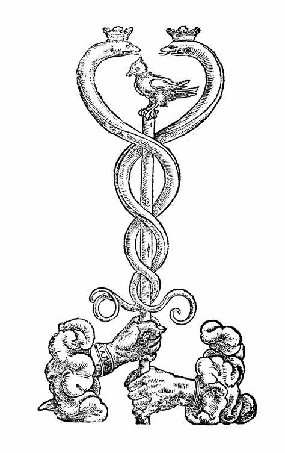

# Introdução à Ciência Sagrada
  

## Programa Agartha  

| :book:| [Prefacio](prefacio.md) |
|:---: |:--- |
|1| [Primeiro semetre de estudo](1-modulo/README.md)  |  
|2| [Segundo semestre de estudo](2-modulo/README.md)  |
|3| [Terceiro semestre de estudo](3-modulo/README.md)  |  

**Federico González**  
All rights reserved.  
*Tradução em português: Igor Silva*

